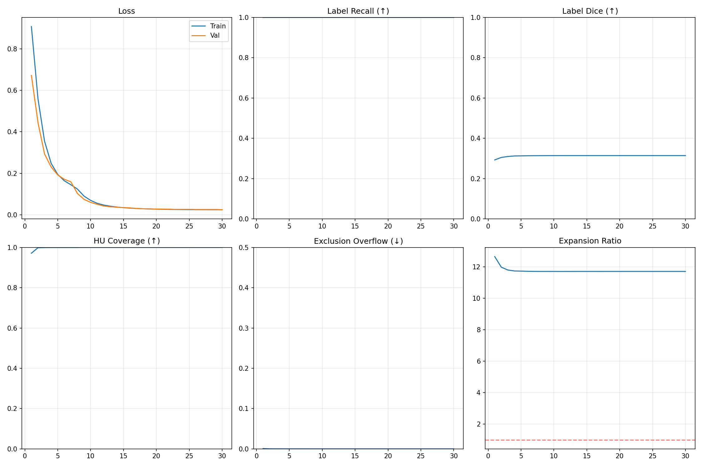
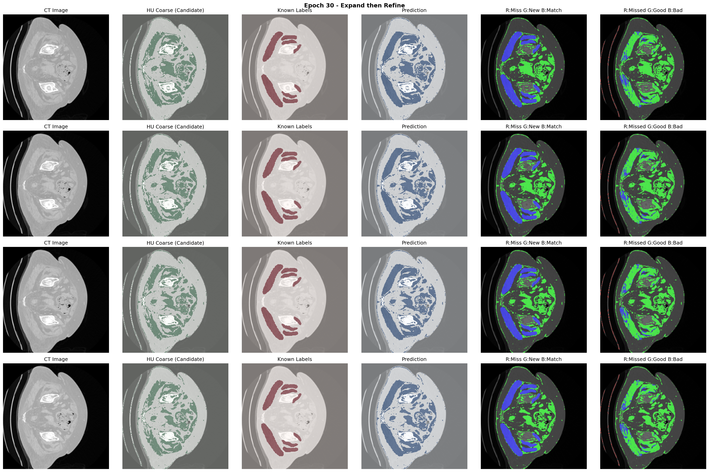

# 肌肉迁移学习 V3 技术报告

## 概述

V3版本采用"先扩后缩"（Expand then Refine）方法，旨在解决V2版本中模型过于保守、覆盖面积不足的问题。核心思想是先利用HU值范围做粗分割以实现高召回率，再通过已标注肌肉区域学习如何精修边界。

## 背景与问题

### V2版本的局限性

V2版本在验证集上取得了不错的指标（HU符合率99.5%，Dice 0.80），但在实际分析中发现了核心问题：

**模型过于保守**：预测的肌肉区域覆盖面积不足，即使是已标注的肌肉区域也没有被完全覆盖。

## 方法设计

### 核心思想

```
先扩：HU值范围粗分割 → 覆盖所有可能是肌肉的区域（高召回）
↓
后缩：以已标注肌肉为参考 → 学习精修边界
```

### 损失函数设计

V3采用了全新的`ExpandThenRefireLoss`损失函数，包含五个分量：

| 损失分量 | 权重 | 作用 |
|----------|------|------|
| 已标注区域对齐 (label_alignment) | 3.0 | 已标注区域必须与标签高度一致 |
| 覆盖奖励 (coverage_reward) | 1.0 | 鼓励覆盖HU合理但未标注的区域 |
| 排除约束 (exclusion) | 5.0 | 空气/骨骼区域强制排除 |
| HU范围外惩罚 (hu_violation) | 1.0 | 轻微惩罚超出HU范围的预测 |
| 边界平滑 (smoothness) | 0.2 | 保持预测边界平滑 |

### 网络结构

采用`MuscleRefineNet`，基于U-Net架构：

- **输入通道数**: 4
  - 通道0: CT图像（归一化后）
  - 通道1: HU粗分割（候选区域）
  - 通道2: 已知肌肉标签（参考）
  - 通道3: 非排除区域掩码
- **特征图通道**: [32, 64, 128, 256]
- **瓶颈层**: 512通道
- **Dropout**: 编码器0.1，瓶颈层0.2

## 超参数配置

### 训练参数

| 参数 | 值 |
|------|-----|
| 学习率 (Learning Rate) | 1e-4 |
| 权重衰减 (Weight Decay) | 1e-5 |
| 批量大小 (Batch Size) | 16 |
| 训练轮数 (Epochs) | 30 |
| 优化器 | AdamW |
| 学习率调度 | CosineAnnealingLR |

### HU值约束

| 参数 | HU值 | 说明 |
|------|------|------|
| 肌肉HU下限 | -29 | 肌肉组织最低HU值 |
| 肌肉HU上限 | 150 | 肌肉组织最高HU值 |
| 空气阈值 | -200 | 低于此值为空气，强制排除 |
| 骨骼阈值 | 300 | 高于此值为骨骼，强制排除 |
| 身体阈值 | -500 | 低于此值为背景 |

### 数据配置

- **受试者数量**: 50
- **目标图像尺寸**: 256×256
- **腹部筛选**: 启用（排除大腿区域）
- **训练/验证比例**: 80%/20%

## 训练结果

### 最终指标

| 指标 | 最终值 | 说明 |
|------|--------|------|
| 标签召回率 | 100% | 已标注肌肉被完全覆盖 |
| 标签Dice | 31.4% | 与标签的重叠度 |
| HU覆盖率 | 99.99% | HU合理区域的覆盖程度 |
| 排除溢出 | 0.0046% | 预测侵入排除区域的比例 |
| 扩展比例 | 11.7x | 预测区域相对标签的扩展倍数 |

### 损失收敛

- 训练损失：从0.907降至0.024
- 验证损失：从0.672降至0.025

### 训练曲线



训练曲线显示：
1. **Loss曲线**：训练和验证损失快速收敛并趋于稳定
2. **Label Recall**：从第一个epoch开始就接近100%
3. **Label Dice**：稳定在约31%，反映扩展策略的设计意图
4. **HU Coverage**：快速达到并保持在99%以上
5. **Exclusion Overflow**：始终保持极低水平
6. **Expansion Ratio**：稳定在约11.7倍

### 预测可视化



可视化说明（从左到右）：
1. **CT Image**: 原始CT图像
2. **HU Coarse (Candidate)**: HU值粗分割候选区域（绿色）
3. **Known Labels**: 已知的肌肉标签（红色）
4. **Prediction**: 模型预测结果（蓝色）
5. **R:Miss G:New B:Match**: 红=漏检，绿=新覆盖，蓝=正确匹配
6. **R:Missed G:Good B:Bad**: 红=HU合理但未预测，绿=HU合理且预测，蓝=HU不合理但预测

## 结果分析

### 优点

1. **高召回率**：100%覆盖已标注肌肉区域
2. **强HU覆盖**：几乎完全覆盖所有HU合理区域
3. **低排除溢出**：极少预测侵入骨骼/空气区域
4. **训练稳定**：损失平稳收敛，无震荡

### 问题与思考

1. **Dice偏低**：约31%的Dice分数反映了"先扩"策略导致的过度扩展
2. **扩展比例大**：11.7倍的扩展意味着预测区域远大于真实标签
3. **边界精度**：虽然覆盖率高，但边界精确度有待提升

### 与V2对比

| 特性 | V2 | V3 |
|------|-----|-----|
| 策略 | 保守预测 | 激进覆盖 |
| 召回率 | 较低 | 100% |
| Dice | ~80% | ~31% |
| 扩展比例 | <1x | 11.7x |
| 漏检问题 | 严重 | 解决 |
| 过度分割 | 无 | 存在 |

## 结论

V3版本成功解决了V2的漏检问题，实现了100%的标签召回率。"先扩后缩"的设计使模型能够覆盖所有可能的肌肉区域。然而，当前版本在"后缩"阶段的边界精修能力有限，导致扩展比例较大。

后续改进方向：
1. 增强边界对齐损失权重
2. 引入形态学后处理
3. 添加边界检测模块
4. 多阶段训练策略

---

*报告生成时间: 2026-01-12*
