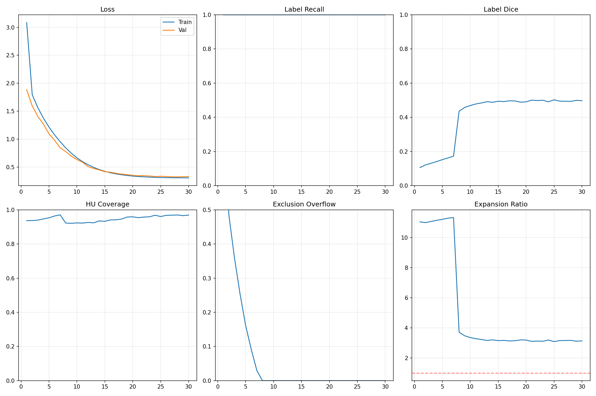
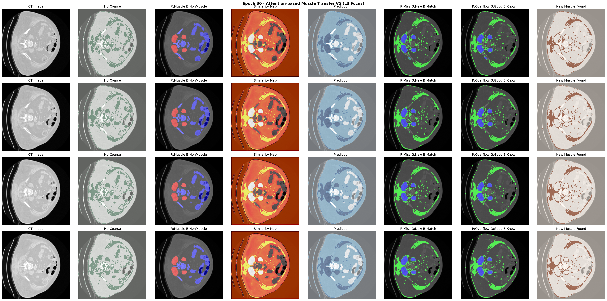

# Rapport Technique sur l'Apprentissage par Transfert Musculaire V5

## Apercu

La version V5 est une version axee sur la vertebre L3, qui se concentre davantage sur les coupes de la region de la vertebre L3 par rapport a V4, en utilisant des mecanismes d'attention multi-couches pour une identification et une extension precises des regions musculaires.

## Resume des Resultats d'Entrainement

> **Note** : Les metriques Loss et Dice ont converge de maniere stable et ne necessitent pas d'attention particuliere.

- **Loss d'entrainement** : 3.08 → 0.31 (convergence stable)
- **Loss de validation** : 1.88 → 0.33 (pas de surapprentissage)
- **Rappel des etiquettes** : 99.99% (couverture parfaite)
- **Dice des etiquettes** : ~0.50 (conforme aux attentes)

Veuillez consulter le graphique des courbes d'entrainement pour les metriques detaillees.



## Description Detaillee des Algorithmes Principaux

### 1. Conception de la Fonction de Perte

V5 utilise une fonction de perte composite a 9 composantes, assurant la precision des predictions et la coherence anatomique a travers plusieurs contraintes :

$$\mathcal{L}_{total} = \sum_{i=1}^{9} w_i \cdot \mathcal{L}_i$$

#### 1.1 Perte d'Alignement des Etiquettes (Label Alignment Loss)

Assure que les predictions du modele couvrent toutes les regions musculaires connues :

$$\mathcal{L}_{label} = \frac{\sum_{p \in \Omega_{muscle}} BCE(\hat{y}_p, y_p)}{\sum_{p \in \Omega_{muscle}} 1}$$

Ou $\Omega_{muscle}$ est la region musculaire etiquetee et $BCE$ est l'entropie croisee binaire.

**Poids** : $w_{label} = 3.0$

#### 1.2 Perte de Recompense de Couverture (Coverage Reward Loss)

Encourage le modele a decouvrir de nouveaux muscles dans les regions non etiquetees avec des valeurs HU raisonnables :

$$\mathcal{L}_{coverage} = \frac{1}{N} \sum_{p \in \Omega_{unlabeled}} (1 - \hat{y}_p) \cdot \mathbb{1}_{HU}(p)$$

Ou :
- $\Omega_{unlabeled} = \Omega_{body} - \Omega_{labeled} - \Omega_{excluded}$
- $\mathbb{1}_{HU}(p) = 1$ quand $-29 \leq HU_p \leq 150$

**Poids** : $w_{coverage} = 1.0$

#### 1.3 Perte de Region d'Exclusion (Exclusion Loss)

Penalise les predictions dans les regions exclues (air, os) :

$$\mathcal{L}_{exclusion} = \frac{1}{N} \sum_{p \in \Omega_{excluded}} \hat{y}_p$$

**Poids** : $w_{exclusion} = 5.0$

#### 1.4 Penalite de Region Non-Musculaire (Non-Muscle Penalty)

Interdit strictement les predictions dans les regions non-musculaires etiquetees (organes, os, vaisseaux) :

$$\mathcal{L}_{non\_muscle} = \frac{\sum_{p \in \Omega_{organ}} \hat{y}_p}{\sum_{p \in \Omega_{organ}} 1}$$

**Poids** : $w_{non\_muscle} = 7.5$ (1.5 fois la perte d'exclusion)

#### 1.5 Perte de Violation HU (HU Violation Loss)

Penalise les predictions en dehors de la plage HU :

$$\mathcal{L}_{HU} = \frac{1}{N} \sum_{p \in \Omega_{body}} \hat{y}_p \cdot (1 - \mathbb{1}_{HU}(p))$$

**Poids** : $w_{HU} = 1.0$

#### 1.6 Perte de Lissage (Smoothness Loss)

Regularisation par variation totale pour assurer des contours lisses :

$$\mathcal{L}_{smooth} = \frac{1}{N} \left( \sum_{i,j} |\hat{y}_{i+1,j} - \hat{y}_{i,j}| + |\hat{y}_{i,j+1} - \hat{y}_{i,j}| \right)$$

**Poids** : $w_{smooth} = 0.2$

#### 1.7 Perte de Coherence de Similarite (Similarity Consistency Loss)

Assure la coherence entre la carte de similarite et les predictions :

$$\mathcal{L}_{sim\_cons} = MSE(\hat{y} \cdot \Omega_{unlabeled}, S \cdot \Omega_{unlabeled})$$

Ou $S$ est la carte de similarite.

**Poids** : $w_{sim\_cons} = 1.5$

#### 1.8 Perte de Supervision de Similarite (Similarity Supervision Loss)

Guide la carte de similarite pour avoir des valeurs elevees dans les regions musculaires etiquetees :

$$\mathcal{L}_{sim\_sup} = BCE(S, y) \cdot (\Omega_{muscle} + 0.3 \cdot \Omega_{unlabeled\_HU})$$

**Poids** : $w_{sim\_sup} = 0.5$

#### 1.9 Penalite de Similarite Non-Musculaire (Similarity Non-Muscle Loss)

Assure que la similarite reste faible dans les regions non-musculaires :

$$\mathcal{L}_{sim\_non} = \frac{\sum_{p \in \Omega_{organ}} \sigma(S_p)}{\sum_{p \in \Omega_{organ}} 1}$$

**Poids** : $w_{sim\_non} = 1.0$

### 2. Mecanismes d'Attention

V5 adopte une architecture d'attention a trois couches, realisant un apprentissage des caracteristiques du local au global.

#### 2.1 Encodage de Position Sinusoidal 2D (Positional Encoding)

Injecte des informations de position spatiale dans les cartes de caracteristiques :

$$PE_{(y,x,2i)} = \sin\left(\frac{y}{H-1} \cdot \pi \cdot e^{-\frac{i \cdot \ln(10000)}{d/4}}\right)$$

$$PE_{(y,x,2i+1)} = \cos\left(\frac{y}{H-1} \cdot \pi \cdot e^{-\frac{i \cdot \ln(10000)}{d/4}}\right)$$

L'encodage en direction X est similaire, occupant la seconde moitie des canaux.

#### 2.2 Auto-Attention Multi-Tetes (Multi-Head Self-Attention)

Capture les relations contextuelles globales dans la couche Bottleneck :

$$Attention(Q, K, V) = softmax\left(\frac{QK^T}{\sqrt{d_k}}\right) V$$

**Optimisation cle** : Sous-echantillonnage 4x pour reduire l'utilisation de la memoire GPU

```
Entree (B, C, H, W)
  ↓ Sous-echantillonnage 4x
(B, C, H/4, W/4)
  ↓ Projection QKV + Attention multi-tetes
(B, C, H/4, W/4)
  ↓ Sur-echantillonnage 4x
Sortie (B, C, H, W) + Connexion residuelle
```

**Configuration** : 8 tetes d'attention, dimension par tete = C/8

#### 2.3 Attention Inter-Regions (Cross-Region Attention)

Utilise les regions musculaires etiquetees comme reference pour se concentrer sur les regions non etiquetees aux caracteristiques similaires :

$$CrossAttn(Q, K, V, M) = softmax\left(\frac{QK^T}{\sqrt{d_k}} + 2.0 \cdot M\right) V$$

Ou $M$ est le masque de region musculaire connue, donnant un poids supplementaire aux regions etiquetees.

**Idee principale** :
1. Query provient des caracteristiques a classifier
2. Key/Value proviennent du contexte global
3. Les regions musculaires etiquetees recoivent un gain d'attention
4. La sortie contient des informations sur les regions similaires aux muscles connus

#### 2.4 Module d'Attention de Similarite (Similarity Attention Module)

Apprend le prototype de caracteristiques musculaires et calcule la similarite globale :

**Etape 1 : Extraction du prototype musculaire**
$$P = \frac{\sum_{p \in \Omega_{muscle}} f_p}{\sum_{p \in \Omega_{muscle}} 1}$$

**Etape 2 : Raffinement du prototype**
$$P' = MLP(P) = W_2 \cdot ReLU(W_1 \cdot P)$$

**Etape 3 : Calcul de la similarite cosinus**
$$S_p = \frac{f_p \cdot P'}{||f_p|| \cdot ||P'||}$$

**Sortie** : Carte de similarite $S \in [0,1]^{H \times W}$, indiquant le degre de similarite de chaque position avec le prototype musculaire.

### 3. Architecture du Reseau

```
Entree (5 canaux)
├── Image CT (normalisee)
├── Segmentation grossiere HU
├── Etiquettes musculaires connues
├── Masque de region non-exclue
└── Masque de region non-etiquetee

    ↓
Encodeur (32→64→128→256)
    ↓ + Encodage de position (premiere couche)
Bottleneck (512) + Auto-attention
    ↓
Decodeur (256→128→64→32)
    ↓ + Attention inter-regions (couche 64 canaux)
Module d'attention de similarite
    ↓
Sortie fusionnee → Prediction finale
```

## Resultats de Visualisation



**Description de la visualisation** :
1. **CT Image** : Image CT originale
2. **HU Coarse** : Segmentation grossiere par valeurs HU
3. **R:Muscle B:NonMuscle** : Rouge=muscle connu, Bleu=region non-musculaire
4. **Similarity Map** : Carte thermique de similarite
5. **Prediction** : Prediction du modele
6. **R:Miss G:New B:Match** : Comparaison des predictions (Rouge=manque, Vert=nouveau, Bleu=correspondance)
7. **R:Overflow G:Good B:Known** : Detection de debordement (Rouge=probleme, Vert=correct, Bleu=connu)
8. **New Muscle Found** : Nouvelles regions musculaires decouvertes

## Conclusion

La version V5, grace a sa fonction de perte composite et ses mecanismes d'attention multi-couches, a atteint :
- 99.99% de rappel des muscles etiquetes
- Un debordement extremement faible dans les regions non-musculaires (<0.001%)
- Une decouverte efficace de nouveaux tissus musculaires dans les regions non etiquetees

---

*Date de generation du rapport : 2026-01-19*
