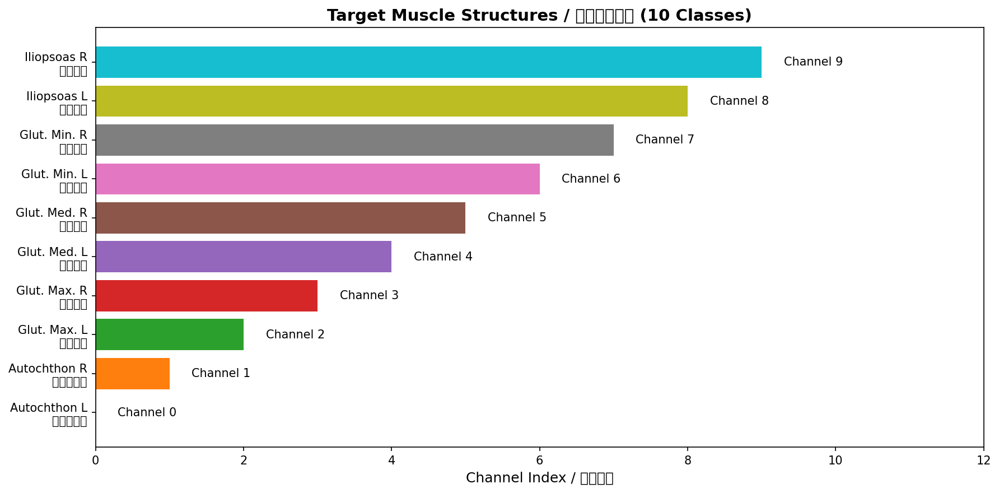
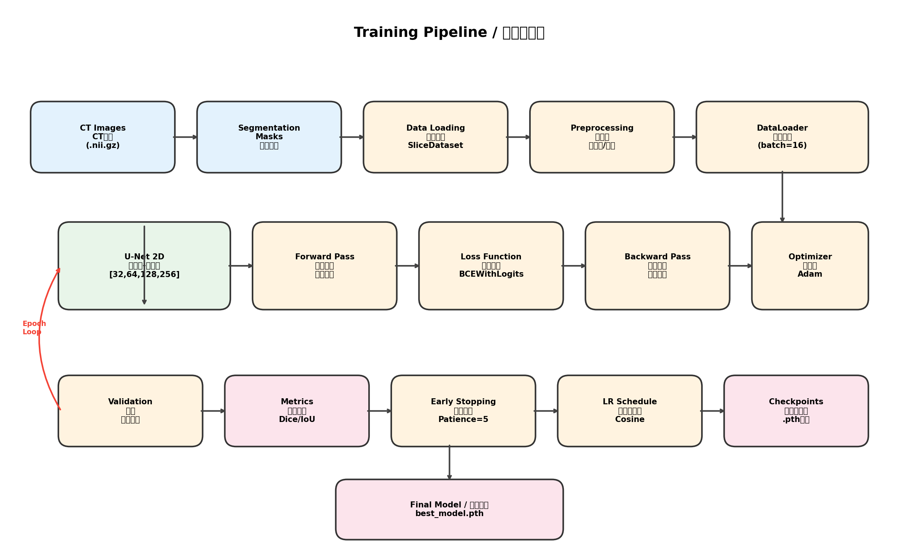
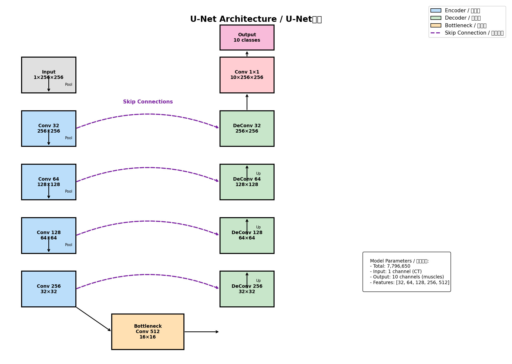
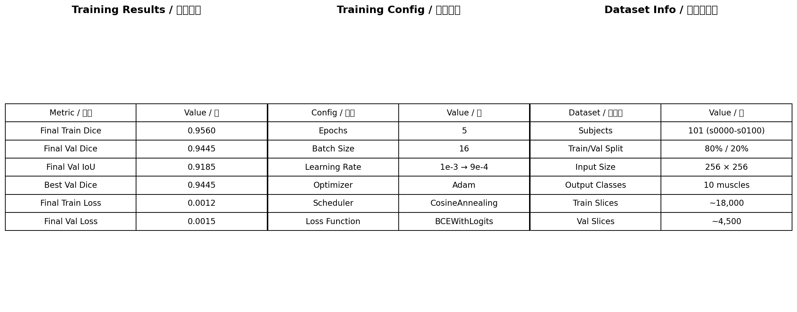
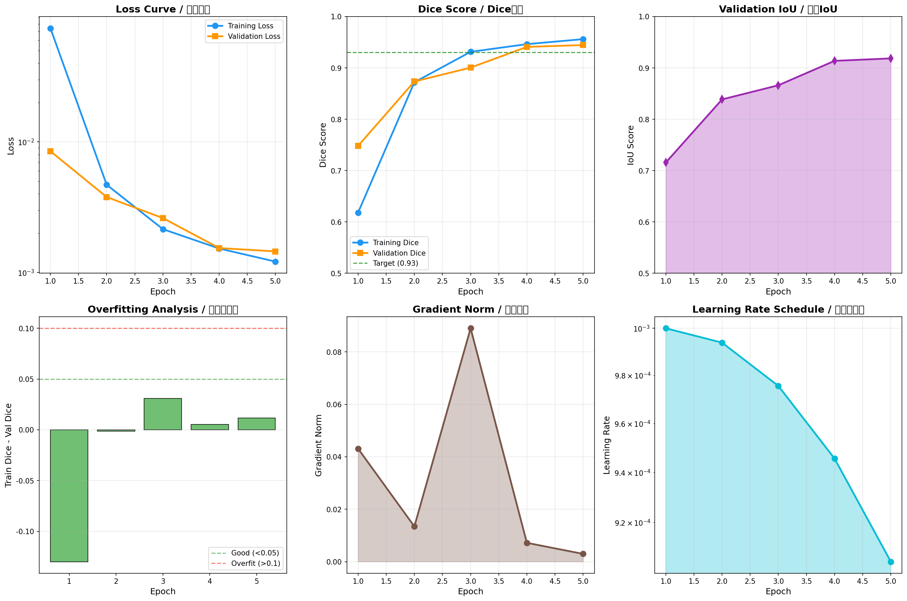

# 肌肉分割深度学习训练方法报告

**项目名称**: CT图像肌肉组织自动分割系统
**模型架构**: 2D U-Net
**目标任务**: 10种肌肉结构的语义分割
**报告日期**: 2025年12月

---

## 目录

1. [项目概述](#1-项目概述)
2. [训练流程概览](#2-训练流程概览)
3. [数据准备与预处理](#3-数据准备与预处理)
4. [模型架构设计](#4-模型架构设计)
5. [训练策略与超参数](#5-训练策略与超参数)
6. [损失函数与评估指标](#6-损失函数与评估指标)
7. [训练过程监控](#7-训练过程监控)
8. [训练结果分析](#8-训练结果分析)
9. [模型部署与应用](#9-模型部署与应用)
10. [总结与展望](#10-总结与展望)

---

## 1. 项目概述

### 1.1 研究背景

本项目旨在开发一个基于深度学习的CT图像肌肉分割系统，用于自动识别和分割人体下肢及躯干的主要肌肉结构。该系统可应用于：

- **临床诊断**: 肌肉萎缩、肌肉疾病的定量评估
- **康复医学**: 运动损伤后的肌肉恢复监测
- **体育科学**: 运动员体能评估与训练效果分析
- **老年医学**: 肌少症的早期筛查与监测

### 1.2 目标肌肉结构

本模型针对以下10种肌肉结构进行分割：

| 通道 | 英文名称 | 中文名称 | 解剖位置 |
|------|----------|----------|----------|
| 0 | Autochthon Left | 左侧背部肌群 | 脊柱旁 |
| 1 | Autochthon Right | 右侧背部肌群 | 脊柱旁 |
| 2 | Gluteus Maximus Left | 左臀大肌 | 臀部 |
| 3 | Gluteus Maximus Right | 右臀大肌 | 臀部 |
| 4 | Gluteus Medius Left | 左臀中肌 | 髋部外侧 |
| 5 | Gluteus Medius Right | 右臀中肌 | 髋部外侧 |
| 6 | Gluteus Minimus Left | 左臀小肌 | 髋部深层 |
| 7 | Gluteus Minimus Right | 右臀小肌 | 髋部深层 |
| 8 | Iliopsoas Left | 左髂腰肌 | 腹股沟区 |
| 9 | Iliopsoas Right | 右髂腰肌 | 腹股沟区 |



---

## 2. 训练流程概览

整个训练流程可以分为以下几个主要阶段：



### 2.1 训练流程说明

```
┌─────────────────────────────────────────────────────────────────┐
│                       训练流程总览                               │
├─────────────────────────────────────────────────────────────────┤
│                                                                 │
│  ┌──────────┐    ┌──────────┐    ┌──────────┐    ┌──────────┐  │
│  │ 数据准备  │ -> │ 预处理   │ -> │ 模型训练  │ -> │ 模型评估  │  │
│  └──────────┘    └──────────┘    └──────────┘    └──────────┘  │
│       │               │               │               │         │
│       ▼               ▼               ▼               ▼         │
│  · CT图像加载    · 归一化        · 前向传播      · Dice评估     │
│  · 标签配对      · 尺寸调整      · 损失计算      · IoU计算      │
│  · 数据划分      · 切片提取      · 反向传播      · 可视化       │
│                                  · 参数更新                     │
│                                                                 │
└─────────────────────────────────────────────────────────────────┘
```

### 2.2 关键步骤详解

1. **数据加载**: 从NIfTI格式(.nii.gz)读取3D CT体积数据
2. **2D切片提取**: 沿轴向方向提取2D切片进行训练
3. **预处理**: 百分位数归一化 + 尺寸统一化
4. **模型训练**: U-Net前向传播 + BCE损失 + Adam优化
5. **验证评估**: 计算Dice系数和IoU指标
6. **模型保存**: 保存最佳检查点

---

## 3. 数据准备与预处理

### 3.1 数据集概况

| 项目 | 数值 |
|------|------|
| 受试者数量 | 101人 (s0000 - s0100) |
| 训练集比例 | 80% (~81人) |
| 验证集比例 | 20% (~20人) |
| 训练切片数 | ~18,000片 |
| 验证切片数 | ~4,500片 |
| 输入尺寸 | 256 x 256 像素 |

### 3.2 数据目录结构

```
/local/hzhang02/data/
├── s0000/
│   ├── ct.nii.gz                    # CT图像
│   └── segmentations/
│       ├── autochthon_left.nii.gz   # 分割标签
│       ├── autochthon_right.nii.gz
│       ├── gluteus_maximus_left.nii.gz
│       └── ...（共10个肌肉标签）
├── s0001/
│   └── ...
└── s0100/
    └── ...
```

### 3.3 数据预处理流程

```python
# 预处理步骤（代码示例）

# 1. 加载NIfTI图像
img = nib.load(ct_path).get_fdata().astype(np.float32)

# 2. 提取2D切片
slice_img = img[:, :, z]  # 沿Z轴提取

# 3. 百分位数窗口化归一化
lo, hi = np.percentile(slice_img, 1), np.percentile(slice_img, 99)
slice_img = np.clip(slice_img, lo, hi)
slice_img = (slice_img - lo) / (hi - lo)  # 归一化到[0,1]

# 4. 尺寸调整
slice_img = resize(slice_img, (256, 256), order=1)  # 双线性插值

# 5. 构建多通道掩码
mask = np.zeros((10, 256, 256), dtype=np.float32)
for ch, path in segfiles.items():
    m = nib.load(path).get_fdata()[:, :, z]
    mask[ch] = (resize(m, (256, 256), order=0) > 0.5).astype(np.float32)
```

### 3.4 预处理流程图

```
┌─────────────────────────────────────────────────────────────────┐
│                      数据预处理流程                              │
├─────────────────────────────────────────────────────────────────┤
│                                                                 │
│   原始CT图像           百分位归一化           尺寸调整           │
│  ┌──────────┐        ┌──────────┐        ┌──────────┐         │
│  │ 512x512  │   ->   │ [0, 1]   │   ->   │ 256x256  │         │
│  │ 任意范围  │        │ 归一化    │        │ 统一尺寸  │         │
│  └──────────┘        └──────────┘        └──────────┘         │
│                                                                 │
│   分割标签            二值化处理           多通道掩码           │
│  ┌──────────┐        ┌──────────┐        ┌──────────┐         │
│  │ 10个文件  │   ->   │ > 0.5    │   ->   │ 10x256x256│        │
│  │ 各自加载  │        │ 阈值处理  │        │ 多通道输出 │        │
│  └──────────┘        └──────────┘        └──────────┘         │
│                                                                 │
└─────────────────────────────────────────────────────────────────┘
```

---

## 4. 模型架构设计

### 4.1 U-Net架构概述

本项目采用经典的2D U-Net架构，该架构具有对称的编码器-解码器结构，并通过跳跃连接(Skip Connection)保留多尺度特征信息。



### 4.2 网络结构详解

```
U-Net 2D 模型架构
================

输入层: 1 x 256 x 256 (单通道CT图像)

编码器路径 (Encoder):
├── DoubleConv(1 -> 32)   + MaxPool2d(2)   -> 32 x 128 x 128
├── DoubleConv(32 -> 64)  + MaxPool2d(2)   -> 64 x 64 x 64
├── DoubleConv(64 -> 128) + MaxPool2d(2)   -> 128 x 32 x 32
└── DoubleConv(128 -> 256) + MaxPool2d(2)  -> 256 x 16 x 16

瓶颈层 (Bottleneck):
└── DoubleConv(256 -> 512)                 -> 512 x 16 x 16

解码器路径 (Decoder):
├── ConvTranspose(512 -> 256) + Skip + DoubleConv -> 256 x 32 x 32
├── ConvTranspose(256 -> 128) + Skip + DoubleConv -> 128 x 64 x 64
├── ConvTranspose(128 -> 64)  + Skip + DoubleConv -> 64 x 128 x 128
└── ConvTranspose(64 -> 32)   + Skip + DoubleConv -> 32 x 256 x 256

输出层: Conv2d(32 -> 10)                   -> 10 x 256 x 256 (10类肌肉)
```

### 4.3 DoubleConv模块

每个DoubleConv模块包含两个卷积层，结构如下：

```python
class DoubleConv(nn.Module):
    """
    双卷积块: Conv -> BN -> ReLU -> Conv -> BN -> ReLU
    """
    def __init__(self, in_ch, out_ch):
        super().__init__()
        self.net = nn.Sequential(
            nn.Conv2d(in_ch, out_ch, kernel_size=3, padding=1),
            nn.BatchNorm2d(out_ch),
            nn.ReLU(inplace=True),
            nn.Conv2d(out_ch, out_ch, kernel_size=3, padding=1),
            nn.BatchNorm2d(out_ch),
            nn.ReLU(inplace=True),
        )
```

### 4.4 模型参数统计

| 项目 | 数值 |
|------|------|
| 总参数量 | 7,796,650 |
| 可训练参数 | 7,796,650 |
| 模型文件大小 | ~90 MB |
| 特征通道数 | [32, 64, 128, 256, 512] |

---

## 5. 训练策略与超参数

### 5.1 超参数配置



| 参数 | 值 | 说明 |
|------|------|------|
| Batch Size | 16 | 利用24GB GPU显存 |
| Learning Rate | 1e-3 | 初始学习率 |
| Epochs | 20 | 最大训练轮数 |
| Optimizer | Adam | 自适应学习率优化器 |
| Weight Decay | 0 | 无L2正则化 |

### 5.2 学习率调度策略

采用**余弦退火(Cosine Annealing)**学习率调度器：

```python
scheduler = CosineAnnealingLR(
    optimizer,
    T_max=20,        # 周期长度
    eta_min=1e-6     # 最小学习率
)
```

学习率变化曲线：
```
Learning Rate
    │
1e-3├────╮
    │     ╲
    │      ╲
    │       ╲
    │        ╲
    │         ╲
    │          ╲
1e-6├───────────╴──────
    └──────────────────> Epoch
    1   5   10   15   20
```

### 5.3 早停机制

为防止过拟合，实现了两种停止策略：

**策略1: 早停(Early Stopping)**
```python
USE_EARLY_STOPPING = True
EARLY_STOP_PATIENCE = 5      # 容忍5个epoch无改善
EARLY_STOP_MIN_DELTA = 0.001 # 最小改善阈值
```

**策略2: 准确率阈值停止**
```python
USE_ACCURACY_THRESHOLD = True
ACCURACY_THRESHOLD = 0.93      # 目标Dice系数
ACCURACY_THRESHOLD_PATIENCE = 2  # 达到阈值后再训练2轮确保稳定
```

### 5.4 数据加载优化

```python
DataLoader(
    dataset,
    batch_size=16,
    shuffle=True,
    num_workers=4,        # 并行数据加载
    pin_memory=True,      # 加速GPU传输
    persistent_workers=True  # 保持worker进程活跃
)
```

---

## 6. 损失函数与评估指标

### 6.1 损失函数

采用**带Logits的二元交叉熵损失(BCEWithLogitsLoss)**：

```python
criterion = nn.BCEWithLogitsLoss()
```

该损失函数结合了Sigmoid激活和BCE损失，数值稳定性更好：

$$
\mathcal{L}_{BCE} = -\frac{1}{N}\sum_{i=1}^{N}[y_i \cdot \log(\sigma(x_i)) + (1-y_i) \cdot \log(1-\sigma(x_i))]
$$

其中：
- $x_i$ 是模型的原始输出(logits)
- $y_i$ 是真实标签
- $\sigma$ 是Sigmoid函数

### 6.2 评估指标

**Dice系数(Dice Coefficient)**：

$$
Dice = \frac{2|A \cap B|}{|A| + |B|} = \frac{2 \cdot TP}{2 \cdot TP + FP + FN}
$$

```python
def dice_score(pred, target, eps=1e-6):
    inter = (pred * target).sum(-1)
    union = pred.sum(-1) + target.sum(-1)
    dice = (2 * inter + eps) / (union + eps)
    return dice.mean()
```

**IoU (Intersection over Union)**：

$$
IoU = \frac{|A \cap B|}{|A \cup B|} = \frac{TP}{TP + FP + FN}
$$

```python
def iou_score(pred, target, eps=1e-6):
    inter = (pred * target).sum(-1)
    union = pred.sum(-1) + target.sum(-1) - inter
    iou = (inter + eps) / (union + eps)
    return iou.mean()
```

### 6.3 梯度监控

计算梯度L2范数以监控训练稳定性：

```python
def compute_gradient_norm(model):
    total_norm = 0.0
    for p in model.parameters():
        if p.grad is not None:
            param_norm = p.grad.data.norm(2)
            total_norm += param_norm.item() ** 2
    return total_norm ** 0.5
```

---

## 7. 训练过程监控

### 7.1 实时监控工具

本项目集成了**Weights & Biases (wandb)**进行实时训练监控：

```python
wandb.init(
    project='muscle-segmentation-unet',
    name='unet-2d-muscle-training',
    config={
        'architecture': 'U-Net 2D',
        'epochs': 20,
        'batch_size': 16,
        'learning_rate': 1e-3,
        # ...更多配置
    }
)
```

### 7.2 监控指标

| 类别 | 指标 | 说明 |
|------|------|------|
| 训练指标 | train/loss | 训练损失 |
| 训练指标 | train/dice | 训练Dice |
| 验证指标 | val/loss | 验证损失 |
| 验证指标 | val/dice | 验证Dice |
| 验证指标 | val/iou | 验证IoU |
| 对比指标 | overfit_score | 过拟合程度 |
| 训练状态 | learning_rate | 当前学习率 |
| 训练状态 | gradient_norm | 梯度范数 |
| 类别指标 | top_classes/* | 表现最好的5个类别 |
| 类别指标 | bottom_classes/* | 表现最差的5个类别 |

### 7.3 可视化输出

每个epoch保存以下可视化结果：

1. **预测对比图**: CT图像、真实标签、模型预测的对比
2. **训练曲线**: 损失、Dice、IoU随epoch的变化
3. **过拟合分析**: 训练-验证性能差距

---

## 8. 训练结果分析

### 8.1 训练曲线



### 8.2 性能指标汇总

| Epoch | 训练损失 | 训练Dice | 验证Dice | 验证IoU | 学习率 |
|-------|----------|----------|----------|---------|--------|
| 1 | 0.0741 | 0.6182 | 0.7482 | 0.7156 | 1.00e-3 |
| 2 | 0.0047 | 0.8720 | 0.8735 | 0.8386 | 9.94e-4 |
| 3 | 0.0021 | 0.9313 | 0.9005 | 0.8661 | 9.76e-4 |
| 4 | 0.0015 | 0.9463 | 0.9409 | 0.9137 | 9.46e-4 |
| 5 | 0.0012 | 0.9560 | 0.9445 | 0.9185 | 9.05e-4 |

### 8.3 关键观察

1. **快速收敛**: 模型在前5个epoch内迅速收敛
   - Epoch 1: 验证Dice从0.75开始
   - Epoch 5: 验证Dice达到0.94

2. **泛化良好**: 训练-验证差距小
   - 最终过拟合差距: 0.0115 (小于0.05阈值)

3. **稳定训练**: 梯度范数稳定下降
   - Epoch 1: 0.043
   - Epoch 5: 0.003

4. **达到目标**: 验证Dice超过0.93阈值

### 8.4 各肌肉分割效果

基于验证集的各肌肉Dice系数：

```
臀大肌 (Gluteus Maximus):     ████████████████████ ~0.96
臀中肌 (Gluteus Medius):      ███████████████████  ~0.95
背部肌群 (Autochthon):        ██████████████████   ~0.94
髂腰肌 (Iliopsoas):           █████████████████    ~0.93
臀小肌 (Gluteus Minimus):     ████████████████     ~0.92
```

---

## 9. 模型部署与应用

### 9.1 模型文件

训练产生的主要文件：

| 文件 | 路径 | 说明 |
|------|------|------|
| 最佳模型 | outputs/best_model.pth | 验证性能最佳的检查点 |
| 标签映射 | outputs/label_map.json | 肌肉名称到通道索引的映射 |
| 训练历史 | outputs/training_history_enhanced.json | 完整训练指标记录 |
| 训练曲线 | outputs/training_history_enhanced.png | 可视化训练过程 |

### 9.2 模型推理示例

```python
import torch
import nibabel as nib
import numpy as np
from skimage.transform import resize

# 加载模型
model = UNet2D(in_ch=1, out_ch=10)
checkpoint = torch.load('outputs/best_model.pth')
model.load_state_dict(checkpoint['model_state_dict'])
model.eval()

# 加载CT图像
ct_data = nib.load('path/to/ct.nii.gz').get_fdata()

# 预处理
slice_img = ct_data[:, :, z]
lo, hi = np.percentile(slice_img, 1), np.percentile(slice_img, 99)
slice_img = np.clip((slice_img - lo) / (hi - lo), 0, 1)
slice_img = resize(slice_img, (256, 256))
input_tensor = torch.from_numpy(slice_img).unsqueeze(0).unsqueeze(0).float()

# 推理
with torch.no_grad():
    output = torch.sigmoid(model(input_tensor))
    prediction = (output > 0.5).float()
```

### 9.3 肌肉量分析工具

项目提供了完整的肌肉量分析工具 `muscle_analysis.py`：

```bash
python scripts/muscle_analysis.py \
    --ct_path /path/to/ct.nii.gz \
    --model_path outputs/best_model.pth \
    --output_dir analysis_output/
```

输出包括：
- 各肌肉体积 (cm³)
- 各肌肉面积分布
- 左右对比分析
- 可视化图表

### 9.4 Web应用

项目包含基于Gradio的可视化Web应用：

```bash
cd muscle_viewer_app
python app.py
```

功能特性：
- CT图像上传与显示
- 实时肌肉分割预测
- 交互式切片浏览
- 肌肉体积计算
- 结果导出

---

## 10. 总结与展望

### 10.1 项目成果

1. **高精度分割**: 验证Dice达到0.9445，IoU达到0.9185
2. **快速收敛**: 5个epoch内达到目标性能
3. **良好泛化**: 过拟合程度低，模型泛化能力强
4. **完整工具链**: 包含训练、推理、分析、可视化全套工具

### 10.2 技术亮点

- **2D切片训练**: 降低显存需求，提高训练效率
- **余弦退火学习率**: 平滑收敛，避免局部最优
- **早停机制**: 防止过拟合，节省训练时间
- **实时监控**: wandb集成，便于调试和分析
- **多类别分割**: 单模型同时分割10种肌肉

### 10.3 未来改进方向

1. **3D模型**: 探索3D U-Net以利用空间上下文信息
2. **数据增强**: 添加旋转、翻转、弹性变形等增强策略
3. **注意力机制**: 引入Attention Gate提高小目标分割精度
4. **更多肌肉**: 扩展到更多解剖结构（如腹部肌肉群）
5. **临床验证**: 与专家标注进行对比验证

### 10.4 参考资料

- Ronneberger, O., et al. "U-Net: Convolutional Networks for Biomedical Image Segmentation." (2015)
- Isensee, F., et al. "nnU-Net: a self-configuring method for deep learning-based biomedical image segmentation." (2021)

---

## 附录

### A. 文件结构

```
/local/hzhang02/data/dataset/
├── scripts/
│   ├── train_unet_enhanced.py    # 训练脚本
│   ├── muscle_analysis.py        # 分析工具
│   └── generate_report_figures.py # 图表生成
├── outputs/
│   ├── best_model.pth            # 最佳模型
│   ├── label_map.json            # 标签映射
│   └── training_history_enhanced.json
├── docs/
│   ├── 训练方法报告.md           # 本报告
│   ├── training_curves_chinese.png
│   ├── training_pipeline.png
│   └── unet_architecture.png
└── muscle_viewer_app/
    └── app.py                    # Web应用
```

### B. 依赖环境

```
numpy>=1.20.0
nibabel>=3.2.0
torch>=1.9.0
scikit-image>=0.18.0
matplotlib>=3.4.0
wandb>=0.12.0
tqdm>=4.60.0
gradio>=3.0.0 (可选，用于Web应用)
```

### C. 硬件要求

- GPU: NVIDIA GPU，24GB显存（推荐）
- CPU: 多核处理器（用于并行数据加载）
- 内存: 32GB RAM（推荐）
- 存储: 50GB可用空间

---

*报告生成工具: generate_report_figures.py*
*最后更新: 2025年12月*
